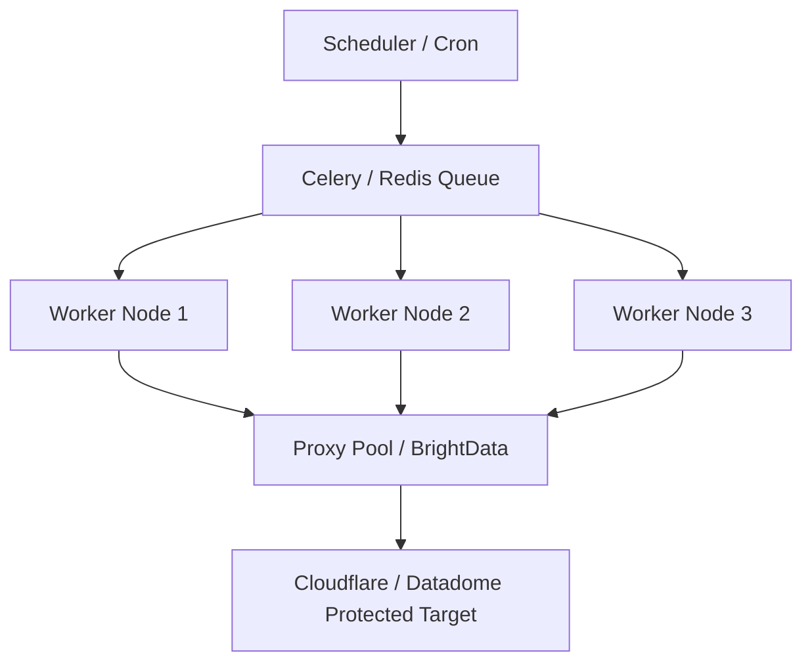

# GraphOne Data Ingestion Infrastructure & Architecture

This document describes the production-grade, distributed architecture designed to scale the GraphOne Intelligence Graph to **500,000+ entities** (startups, products, research papers, jobs, and news signals) while ensuring raw data fidelity, real-time freshness, and robust LLM enrichment.

---

## Current Prototype Implementation & Scalability

The submitted implementation uses **SQLite, Async Python, Streamlit, LiteLLM, and local semantic embeddings (`sentence-transformers`)**. 

**Can this prototype scale to 500k+ entities?**
The current implementation can scale substantially through vertical scaling and asynchronous processing (using strict asynchronous `Semaphores` and exponential LLM backoffs via `tenacity`). SQLite is sufficient for the current prototype and moderate-scale workloads. 

For large-scale highly concurrent distributed ingestion workloads (500k+ entities), PostgreSQL and distributed worker orchestration are recommended. Achieving maximum speed via **horizontal scaling** (distributing processing across multiple Kubernetes pods) requires hot-swapping the SQLite driver for PostgreSQL (to avoid `database is locked` concurrency errors). Furthermore, pushing massive row counts directly into Google Sheets will crash the API payload limits, so the exporter must be detached.

The distributed architecture (Redis, Celery, Neo4j, vector databases, Kubernetes) detailed below represents the proposed production-scale deployment path to bypass these horizontal limitations.

---

## 1. Multi-Tier Crawling & Anti-Bot Bypass Strategy (Scale to 500,000+ Entities)

To scale from thousands of test records to hundreds of thousands of records, we replace single-node loops with a **Distributed Agentic Scraper Architecture**:



### Scraping Infrastructure Components:
1. **Task Distribution (Celery + Redis/RabbitMQ)**:
   - Scraping tasks are divided into tiny, discrete units (e.g., "Scrape YC Company X", "Fetch arXiv Day Y").
   - Workers consume tasks concurrently from the queue. This prevents a single bottleneck from halting the pipeline.
2. **Dynamic Proxy Pools & Headless Browsers**:
   - To bypass aggressive bot protection (Cloudflare, Datadome), request traffic is routed through **residential proxy pools** (e.g., BrightData, Webshare) with automatic IP rotation.
   - For heavily JS-rendered sites, we use **Playwright Async** executing inside Docker containers, combined with stealth libraries (`puppeteer-extra-plugin-stealth` equivalents) to mask browser fingerprints.
3. **Stateless Crawler Nodes**:
   - Crawler nodes are deployed as horizontal auto-scaling pods inside **Kubernetes (EKS)**. If target queue size grows, Kubernetes spins up more scraper workers dynamically.

---

## 2. Robust LLM Ingestion & Rate Limit Handling (413 & 429 Management)

Structuring raw text/HTML into schemas relies on a combination of context-window optimization and strict API rate management:

```text
[Raw Crawled Payload]
          │
          ▼
┌──────────────────┐
│ Payload Chunking │ ──► Truncates to first 70% and last 30% of target budget (413 Protection)
└──────────────────┘
          │
          ▼
┌──────────────────┐
│  Fallback Chain  │ ──► Tier 1: Gemini Flash (Low Latency / Large Context)
└──────────────────┘          │ (If 429 / Fail)
                              ▼
                       Tier 2: Groq Llama 3 (Ultra High Speed / Dedicated Rate)
                              │ (If 429 / Fail)
                              ▼
                       Tier 3: DeepSeek-Chat / OpenRouter (Cost Efficient)
                              │ (If All Fail)
                              ▼
                       Dead-Letter Queue (DLQ) Exception
```

### Rate Limit (429) & Window Size (413) Strategies:
* **Context Budgeting (413 Avoidance)**: Before payload submission, the orchestrator truncates strings to `max_chars` (default 12,000) using a lead-and-conclusion preservation algorithm (extracting first 70% and last 30% of content). This retains titles, summaries, contact links, and legal names while removing repetitive middle boilerplate.
* **Leaky Bucket Rate Limiter**: Rather than purely reactive backoffs, scraper workers route LLM requests through a centralized **Redis Token Bucket** manager. This keeps global API calls strictly under vendor ceilings (e.g., 15 RPM for free tiers, 3,000 RPM for production).
* **Exponential Backoff with Jitter**: If a 429 is received, the script backs off using:
  $$\text{Delay} = (\text{Base} \times 2^{\text{Attempt}}) + \text{RandomJitter}(0.1, 1.0)$$
  The random jitter prevents "thundering herd" issues where multiple workers retry simultaneously.

---

## 3. Real-Time Ingestion & Freshness Guarantee

To ensure that jobs and news remain under **24-hour freshness** without processing duplicates across distributed crawler nodes:

1. **Sliding Time-Window Filters**:
   - Feeds are evaluated using a strict UTC filter:
     $$\text{Current Time} - \text{Publish Date} \le 24\text{ hours}$$
   - Custom regex patterns parse relative date strings (e.g., `"2 hours ago"`, `"1 day ago"`) into standardized ISO-8601 timestamps.
2. **Double-Ingestion Prevention (SHA-256 Content Hashes)**:
   - Prior to database writes, a composite hash is generated for each entity:
     $$\text{Hash} = \text{SHA256}(\text{Title} + \text{NormalizedSourceURL})$$
   - This hash is checked against a distributed **Redis Bloom Filter** (or a Redis Set).
   - If the hash exists, the entity is skipped instantly without triggering downstream LLM extraction, conserving API tokens.
3. **Delta Crawling (E-Tag & Last-Modified Headers)**:
   - Crawlers store the `ETag` and `Last-Modified` headers of news blogs/RSS feeds.
   - Subsequent requests use `If-None-Match` and `If-Modified-Since` headers to avoid downloading payloads that haven't changed.

---

## 4. Multi-Tier Database & Vector/Graph Storage Strategy

A single database model cannot effectively represent the startup and venture research landscape. We propose a **Polyglot Persistence Layer**:

```text
                       [Ingestion Pipeline]
                                │
          ┌─────────────────────┼─────────────────────┐
          ▼                     ▼                     ▼
┌──────────────────┐  ┌──────────────────┐  ┌──────────────────┐
│  PostgreSQL RDS  │  │   Neo4j Graph    │  │  Pinecone/Milvus │
└──────────────────┘  └──────────────────┘  └──────────────────┘
 - Canonical Records   - Entity Relations    - Vector Embeddings
 - Mappings Log        - Venture Graph       - Paper Search
 - Jobs & News Feed    - Star Connections    - Semantic Match
```

### Database Specifications:
1. **Primary Structured Storage: PostgreSQL (Amazon RDS)**:
   - Stores the canonical records for startups, products, jobs, and news.
   - Enforces relational consistency (e.g., products map to a `startup_id` foreign key).
   - Stores the raw-to-canonical entity mapping tables for auditing.
2. **Venture & Relationship Graph: Neo4j**:
   - Represents the core "Intelligence Graph" mapping startups, founders, products, papers, and repos.
   - **Nodes**: `Startup`, `Product`, `Paper`, `Author`, `Repository`, `Job`.
   - **Edges**: `DEVELOPED`, `PUBLISHED`, `WRITTEN_BY`, `HAS_CODE`, `HIRED_FOR`.
   - Allows complex graph traversals (e.g., "Find all YC AI startups that have published papers with GitHub repos that have > 1,000 stars").
3. **Vector Embeddings Storage: Pinecone / Milvus**:
   - Research paper abstracts and news content are converted to embeddings (using `text-embedding-3-small` or local BGE embeddings) and indexed.
   - Powers semantic semantic search (e.g., "Find papers discussing speculative decoding in LLMs") and enables startup deduplication by comparing company mission statements semantically.
